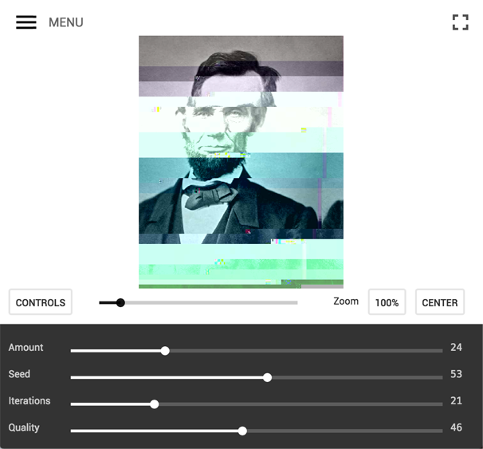

image glitch experiment
===

[](https://greenkeeper.io/)

this is an experiment for the web browser. it corrupts jpg images so that they appear "glitched".

[](http://snorpey.github.io/jpg-glitch/)

[online demo](http://snorpey.github.io/jpg-glitch/)

this experiment is very much based on the [smack my glitch up js](https://github.com/Hugosslade/smackmyglitchupjs) script.

glitch effect code
---
if you're a developer and just interested in the code for the glitch effect, there's a separate repository for that: [glitch-canvas](https://github.com/snorpey/glitch-canvas).

third party code used in this experiment
---
* [localforage](https://github.com/mozilla/localForage) by [mozilla](https://github.com/mozilla), Apache License 2.0
* [requirejs](http://requirejs.org/), by [jrburke](https://github.com/jrburke), BSD & MIT license
* [almond](https://github.com/jrburke/almond), by [jrburke](https://github.com/jrburke), BSD & MIT license
* [javascript-md5](https://blueimp.github.io/JavaScript-MD5/), by [blueimp](https://github.com/blueimp), MIT license
* [reqwest](https://github.com/ded/reqwest/), by [ded](https://github.com/ded), MIT license
* [glitch-canvas](https://github.com/snorpey/glitch-canvas/), by [snorpey](https://github.com/snorpey), MIT license
* [material design icons](https://github.com/Templarian/MaterialDesign), by [templarian](https://github.com/templarian), Open Font License 1.1

license
---
[MIT License](LICENSE)

development
---
if you're interested in adding features, fixing bugs the code, or running the tool on your own server, here are some pointers to help you get familar with the code base.

if you have questions about the code, don't hesitate to open an [issue](issues) or send me an email.

* ``config.js``: all defaults and settings are in here
* ``glitcher.js`` the main app starting point. all events are hooked up in here.
* the app does not use any big dom libraries or app frameworks (like jquery, angular or react)
* where possible, the app uses webworkers for complex tasks
* all strings that are displayed to the user are located in the ``lang/`` folder. for each language, a different file is created.
* the app uses a serviceworker to make it available offline in [browsers](http://caniuse.com/#feat=serviceworkers) that support it
* the app was built without any preprocessors in mind. using the [build script](#build-script) is entirely optional and not required to get the app to work.

build script
---
the build script takes care of concatenating and minifying all scripts and styles. it uses [gruntjs](http://gruntjs.com/).

please make sure that both [nodejs](http://nodejs.org/) and [npm](http://npmjs.com) are set up properly] on your machine.

run ```npm install``` to install the dependencies of the build script.

to build, run ```npm run build``` the optimized files will get copied to the ```production/``` folder.

missing somehing?
---

found a bug? missing a feature? instructions unclear? are you using this tool in an interesting project? maybe have a look at the [issues](../../issues), open a pull request and let me know. thanks!

most importantly
---

thank you for taking a look at this repo. have a great day :)

